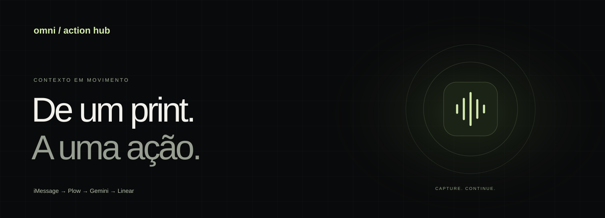
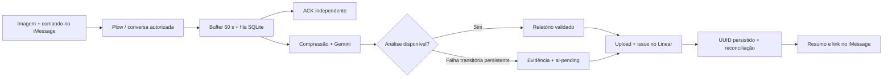

# Omni-Action Hub

**Menos relato. Mais resolvido.** Uma captura de tela e “Registra esse bug” no
iMessage viram uma issue no Linear, com evidência anexada e confirmação na conversa.

[Começar](#instalação) · [Arquitetura](#arquitetura-em-um-fluxo) ·
[Avaliação de IA](evals/README.md) · [Landing page](website/README.md) ·
[Distribuição](docs/DISTRIBUTION.md)

| Evidência | Resultado observado | Escopo |
| --- | --- | --- |
| Suíte em 14/09/2026 | 100 testes aprovados | Unitários e integração local; sem promessa de ausência de bugs |
| Concorrência | 72 jobs sem tickets simulados duplicados | Lotes com 1, 2 e 4 workers |
| Confirmação de recebimento | 1,371 s | Uma entrega real do ACK; não é tempo de criação do ticket |
| Representação para visão | 6,23 MB → 865 KB / 236 ms | Benchmark sintético; cerca de 86% menos bytes, não 86× |

**Status:** gateway local validado; distribuição pública, instalação independente
e validação com três pessoas continuam pendentes. Há um harness de ML Evals, mas
nenhum F1 real é publicado sem o dataset anotado. O [relatório](docs/evaluation-2026-09-14/REPORT.md)
detalha os limites; [VALIDATION.md](VALIDATION.md) guarda as demonstrações históricas.

## Arquitetura em um fluxo



A execução é local; as APIs são externas. Fotos isoladas aguardam em silêncio.
O modelo sugere metadados, mas não escolhe credenciais, destino ou ferramentas.
Falhas de autenticação exigem correção, sem criar um fallback enganoso.

## O que esta versão faz

- Aceita o comando com uma imagem na mesma mensagem ou em resposta citada a uma imagem.
- Atende apenas o proprietário, na conversa principal identificada pelo Plow.
- Mantém time e projeto do Linear fixos na configuração da instalação.
- Classifica bug, melhoria (`feature`) ou tarefa (`task`); extrai evidência,
  comportamento esperado, severidade, prioridade, projeto mencionado e tags.
  Prioridade, projeto e tags são sugestões na descrição: não mudam o destino
  configurado nem os campos operacionais do Linear automaticamente.
- Persiste o trabalho antes de confirmar recebimento ao transporte.
- Recupera criação incerta consultando o UUID definido antes da mutation.
- Mantém uma fila de respostas separada da criação do ticket.

É um gateway de propósito específico: o código herda o transporte do plugin
oficial, mas substitui a etapa de despacho ao agente genérico. Não há shell,
navegador ou ferramenta de comunicação exposta ao modelo. O runtime base e seu
bootstrap de credenciais permanecem na imagem; o executável do serviço
`hermes-gateway` passa a iniciar `omni.gateway`.

## Pré-requisitos

- macOS com Docker Desktop funcional e Docker Compose **2.30 ou superior**.
- Python 3 e Git para o instalador.
- Conta/linha Plow e telefone habilitado para a verificação do serviço.
- Chave da **API Gemini** com acesso ao modelo configurado.
- Chave pessoal Linear com acesso ao time e permissão para criar issues/upload.
- UUID do time; opcionalmente, UUID de um projeto desse time.

Use “Copy model UUID” no Linear para obter os identificadores. Cada pessoa
configura suas próprias chaves. Elas não devem ser enviadas por chat, commitadas
ou incluídas na imagem. O fluxo usa serviços externos: screenshots passam pelo
Plow e são enviados ao Gemini e ao armazenamento privado do Linear.

A base escolhida é `linux/amd64`; o Compose fixa essa plataforma. No Apple
Silicon isso depende da emulação do Docker. O build amd64 e sua execução em Apple Silicon foram validados via emulação. Não há imagem ARM nativa.

## Instalação

Abra o terminal **nesta pasta** e execute:

```sh
sh scripts/install.sh
```

O instalador verifica o Docker, obtém a CLI oficial em uma revisão fixa, abre o
login Plow, lista linhas livres e solicita a linha a ativar. Se a conta ainda
não tiver uma linha, execute `work/plow-agents/bin/plow-agents login --new-line`
e repita o instalador. A CLI pode exigir permissões/aceites próprios do serviço.

Em seguida, o assistente de configuração descobre a conversa principal por
consulta autenticada ao Plow, solicita chaves localmente com entrada oculta e
grava `omni.env` com modo `0600`. `plow-credentials` também fica em `0600`.
O Compose usa `env_file` no formato `raw`, preservando caracteres das chaves.

Se preferir executar as etapas separadamente:

```sh
# Após obter a CLI oficial, execute os comandos dentro desta pasta:
plow-agents login
plow-agents lines
plow-agents mint ln_SUA_LINHA
python3 scripts/setup.py
docker compose up --build -d
docker exec -it omni-action-hub-agent-1 /bin/sh -c "omni doctor"
```

O bind de credenciais recusa arquivo ausente; não cria uma pasta acidentalmente.
Não monte `chat.db`, o diretório pessoal ou o socket Docker no container.

Quando uma imagem de release estiver publicada e acessível, sua instalação
poderá usar `OMNI_IMAGE=ghcr.io/SEU_REPOSITORIO:v0.1.0 sh scripts/install.sh`.
Esse endereço é um exemplo, **não uma imagem disponível**. A meta de cinco
minutos precisa ser medida em uma instalação real com imagem pré-construída;
o primeiro build local não satisfaz essa meta por definição.

## Uso

1. Capture a tela com `Cmd+Shift+4`.
2. Envie a imagem e “Registra esse bug” na mesma mensagem à linha do agente,
   ou responda especificamente à mensagem da imagem com esse comando.
3. Acrescente o comportamento esperado se você o conhecer.
4. Aguarde “Bug registrado”, o identificador e o link do Linear.

Comandos reconhecidos no início da mensagem: `Registra esse bug`,
`Registra essa tarefa`, `Registra essa melhoria`, `Cria um card`, `/bug`,
`/task` e `/feature` (também variantes com “registre” e “crie”). Cada pedido aceita exatamente uma imagem PNG,
JPEG ou WebP, até 10 MB e 25 megapixels. O Omni normaliza para PNG e remove
metadados. HEIC/HEIF, áudio, documentos e várias imagens recebem pedido de correção.
Uma imagem enviada isoladamente não autoriza a criação de um ticket.

Um screenshot não prova a causa do erro, o impacto ou como reproduzi-lo. O
relatório instrui a IA a reconhecer essas lacunas; qualidade semântica ainda
exige avaliação com exemplos reais e triagem pela equipe.

## Diagnóstico e recuperação

```sh
docker compose ps
docker exec -it omni-action-hub-agent-1 /bin/sh -c "omni doctor"
docker exec -it omni-action-hub-agent-1 /bin/sh -c "omni status"
docker exec -it omni-action-hub-agent-1 /bin/sh -c "omni reconcile UUID_DO_TRABALHO"
docker exec -it omni-action-hub-agent-1 /bin/sh -c "omni retry-reply UUID_DO_TRABALHO"
```

`doctor` faz consultas de leitura às APIs. Verifica acesso ao modelo Gemini e
ao destino Linear; não faz inferência paga nem testa a criação/upload. O teste
completo exige enviar uma imagem real. `status` mostra somente IDs internos,
estados, tentativas e contagens de uso; não mostra mensagens nem chaves.

`reconcile` consulta um ticket incerto pelo UUID exato e enfileira seu link se
ele existir. Nunca repete a criação. `retry-reply` reenvia a resposta salva.
Após três tentativas de entrega malsucedidas, a resposta fica pausada.

Os estados principais são `queued → creating → ready → done`. Uma criação
não confirmada fica `unknown → held` após informar o usuário. Um resultado
vazio na consulta não é prova de que uma mutation em andamento não poderá
concluir depois; por isso a recriação continua suspensa.

O SQLite garante transações locais. Ele não torna a API do Linear e o envio de
mensagens uma transação distribuída. Uma queda imediatamente após o envio pode
duplicar **a resposta**; a recuperação não repete a mutation de criação.

Imagens de trabalhos bem-sucedidos são removidas após salvar o ticket. Imagens
temporárias de falhas expiram em 24 horas enquanto o gateway está rodando,
incluindo limpeza ao reiniciar. Relatórios e registros de auditoria permanecem
no volume. A remoção local não exclui os dados já enviados aos provedores.


### Plow e s6: diagnóstico e recuperação

Use os comandos `docker exec` acima. O CLI agora carrega diretamente as
variáveis protegidas publicadas pelo bootstrap do Plow; não depende de
`with-contenv`, `execlineb` ou `ifelse`. O wrapper `scripts/control.sh` foi
simplificado para delegar a `docker exec`, mas o caminho direto é o recomendado.

O gateway registra a plataforma `plow_chat` antes de instanciá-la. Falhas de
conexão não encerram a fila: há reconexão com espera progressiva entre 5 e 300
segundos, além das rotinas de recuperação oficiais do transporte. O healthcheck
fica negativo enquanto o WebSocket está desconectado e volta a positivo quando
a conexão é recuperada. Logs mostram eventos e tipos de erro, nunca tokens.

Os tickets temporários do WebSocket são obtidos novamente pelo transporte.
Um token de agente realmente revogado exige credencial nova: `login` autentica
a CLI, mas não substitui por si só o token usado pelo container. Nesse caso,
use a rotação oficial (`work/plow-agents/bin/plow-agents rotate`) e recrie o
container com `docker compose up -d --force-recreate`. Não repita a criação
de tickets manualmente para contornar uma resposta ausente.

## Telemetria e competição

A imagem inclui o cliente oficial do Agent Index, fixado por commit e checksum,
em um serviço s6 separado. O gateway grava apenas contagens retornadas pelo
Gemini em um SQLite próprio, compatível com `session_model_usage` do coletor.
O reporter aponta exclusivamente para essa base; não soma também a base de
sessões do Hermes. Tokens de cache são separados dos tokens de entrada e os
tokens de raciocínio são incluídos na saída uma vez.

O teste executa o **cliente oficial real**, localmente, para comprovar leitura
e ausência de contagem dupla em coletas repetidas. A aceitação pelo leaderboard
e a elegibilidade deste gateway restrito ainda dependem de teste/validação
pela organização. Chamadas que tenham consumido tokens, mas perdido a resposta
na rede, não podem ter seu uso reconstruído e não são estimadas.

Durante desenvolvimento, deixe `AGENT_ID` vazio. Antes da competição:

1. Publique o repositório e uma release da imagem.
2. Escolha um ID disponível no Agent Index e configure-o em `omni.env`.
3. Reinicie com `docker compose up -d --force-recreate`.
4. O cliente oficial tenta registrar a instalação e enviar contagens por hora.
5. Complete nome, descrição e instruções no Agent Index, confira os contadores
   com uma chamada real e solicite a verificação da equipe organizadora.

A página oficial informa que apenas agentes verificados podem vencer. A fórmula
de pontuação, o teto de tokens e a eliminação por instalação superior a cinco
minutos não foram confirmados. Não use consumo artificial para testar o ranking.

## Desenvolvimento e testes

```sh
python3 -m venv .venv
.venv/bin/pip install -e '.[test]'
.venv/bin/python scripts/fetch-reporter.py
.venv/bin/python scripts/fetch-transport.py
.venv/bin/pytest -q
```

Os downloads são fontes públicas fixadas por SHA/checksum para testes offline.
Os testes não criam tickets nem enviam mensagens. O workflow de GitHub Actions
testa alterações e publica em GHCR somente ao receber uma tag `v*`, após passar
nos testes. Configure a visibilidade pública do pacote para distribuição.

## Parar, atualizar e desinstalar

`docker compose down` para preservando dados. Para atualizar código, execute
os testes e `docker compose up --build -d`. Mudanças em modelo, credenciais ou
destino são feitas localmente em `omni.env`; recrie o container para aplicá-las.
Guarde a versão anterior da imagem antes de atualizar. Evite reconfigurar o
destino com trabalhos pendentes.

Para remover definitivamente **esta instalação**, use:

```sh
work/plow-agents/bin/plow-agents revoke
docker compose down -v
rm -f omni.env plow-credentials
```

`down -v` apaga memória, auditoria e fila desta instalação. Não remove tickets
do Linear nem revoga suas chaves Gemini/Linear; revogue essas chaves nas contas
se não forem mais necessárias. Não execute a remoção durante uma criação incerta.

## Fontes técnicas

- [Base Plow](https://github.com/plow-pbc/plow-hermes-agent)
- [Plugin Plow Chat](https://github.com/plow-pbc/hermes-plugin-plow)
- [CLI de credenciais](https://github.com/plow-pbc/plow-agents)
- [Agent Index](https://aiworthusing.com/agent-index)
- [API Gemini GenerateContent](https://ai.google.dev/api/generate-content)
- [API Linear](https://linear.app/developers/graphql)
- [Upload privado no Linear](https://linear.app/developers/how-to-upload-a-file-to-linear)

### Imagem e comando em mensagens separadas

Envie uma imagem e, em até **60 segundos**, envie “Registra esse bug” na mesma
conversa, com o mesmo remetente autenticado. A imagem aguarda em SQLite sem
acionar Gemini nem enviar resposta. A próxima mensagem de texto encerra essa
associação; somente um comando reconhecido autoriza criar o ticket. Se houver
mais de uma imagem pendente, o agente pede esclarecimento.

Também é possível responder ao balão original. O transporte oficial resolve
`reply_to.message.attachments`; quando o evento fornece apenas `reply_to_guid`,
o Omni procura a imagem pelo GUID ou UID na mesma conversa e remetente. Uma
referência explícita nunca usa outra foto recente como alternativa. Imagens
sem uso ficam disponíveis para essa referência por até 24 horas; a associação
automática continua limitada a 60 segundos. Ao transferir a imagem para um job,
o buffer é consumido na mesma transação que cria o job. Após sucesso, a cópia
temporária do job é excluída. O buffer sobrevive ao reinício do container.

O Linear faz até três tentativas para falhas de conexão anteriores ao envio,
com espera de 1 e 2 segundos. Leituras e uploads já possuem retry para falhas
transitórias. Se a criação pode ter sido enviada (por exemplo, timeout de leitura),
o agente consulta o UUID persistido antes de decidir o resultado e suspende
recriação quando há dúvida.

Prova local reproduzível, sem credenciais nem chamadas externas:

```sh
python3 -m pip install -e '.[test]'
./scripts/test-image-buffer.sh
```

O teste `test_image_then_text_two_seconds` aguarda dois segundos reais, usa o
workflow e SQLite de produção, e verifica análise única, ticket único e envio
do link com clientes externos simulados. Para outra instalação Python, defina
`PYTHON=/caminho/para/python` ao executar o script.

### Diagnóstico de anexos reais e tolerância à ordem de chegada

O gateway usa `/var/lib/hermes/omni/downloads`, criado e testado pelo próprio
usuário `hermes`. Ele não depende de `/var/lib/hermes/image_cache`: um diretório
legado pertencente a root pode permitir download HTTP e ainda impedir a gravação.
O `omni doctor` agora também verifica `storage`; a inicialização do gateway testa
escrita real antes de publicar saúde.

A janela de 60 segundos agora funciona nas duas ordens. Um comando sem imagem
fica no estado persistente `waiting`; se a imagem chegar depois, o mesmo job
recebe o anexo. Sem imagem após o prazo, há uma única resposta de esclarecimento.
Uma foto sozinha não envia mensagens, mesmo se o anexo estiver indisponível;
esse caso a falha aparece nos logs. Replies explícitos não usam uma foto diferente
como alternativa. Dois comandos pendentes ambíguos exigem esclarecimento.

O WebSocket, a identidade, o cursor e o envio continuam usando o plugin oficial.
O Omni substitui a função de resolução de mídia na instância privada do módulo,
antes de conectar; os arquivos do plugin oficial não são editados. O resolvedor
aceita PNG/JPEG/WebP, até 10 MB, faz streaming, limita concorrência a dois downloads,
rejeita redirecionamentos e endereços fora do caminho `/v1/` da origem Plow permitida,
não envia credenciais ao baixar URLs assinadas e remove downloads interrompidos.
Há até três tentativas transitórias, com prazo total de 60 segundos por resolução.

Diagnóstico reproduzível com um anexo real já recebido na conversa configurada:

```sh
docker exec -i omni-action-hub-agent-1 /bin/sh -c 'omni doctor'
docker exec -i omni-action-hub-agent-1 /opt/hermes/.venv/bin/python < scripts/verify-live-media.py
```

O segundo comando muda para UID 10000, baixa a imagem real, valida o arquivo e
prova foto silenciosa → dois segundos → comando, em uma fila temporária isolada.
Ele não cria ticket nem envia mensagem. Remove a fila e os arquivos ao terminar.
Os logs de produção agora mostram horário, decisão, contagem de anexos e hashes
de identificadores; não incluem conteúdo de mensagens, imagens, tokens ou URLs
assinadas. Falhas HTTP indicam provedor, status e tentativa.

### Experiência de produto e distribuição

Agora o fluxo confirma o recebimento, informa uma retentativa sem repetir avisos
e entrega título, prioridade **sugerida** e URL. Se o Gemini esgotar retries
transitórios, cria um relato com a evidência original e `ai-pending`. O gateway
prepara essa label fixa na inicialização; permissões insuficientes aparecem no
diagnóstico. Consulte [DESIGN.md](DESIGN.md) e a
[arquitetura de produto](docs/PRODUCT-ARCHITECTURE.md).

```sh
# No container em execução; --deep usa tokens e testa visão/schema de verdade.
docker exec -i omni-action-hub-agent-1 /bin/sh -c 'omni doctor --deep'

# Em uma nova máquina, após configurar contas, credencial Plow e imagem publicada:
cp .env.prod.example .env
chmod 600 .env
# Preencha .env, incluindo OMNI_IMAGE e PLOW_CREDENTIALS_FILE.
docker compose --env-file .env -f docker-compose.prod.yml up -d --wait
```

O Compose de produção tem `pull_policy: always`, não contém `build`, exige as
variáveis essenciais e persiste os dados em volume. A publicação da imagem no
registro precisa acontecer antes desse comando; não há uma URL de imagem pública
presumida. O caminho indicado para a credencial Plow deve existir na máquina de
destino. Para segredos com `$`, use valores entre aspas simples no `.env`.

Testes de produto: `python -m pytest -q tests/test_product.py`. Eles cobrem ACK
sob inferência lenta, deduplicação de avisos após reinício, fallback com clientes
HTTP reais sobre transporte simulado, label fixa, validação do catálogo e imagem
com alto nível de detalhe reduzida para menos de 1 MB.
