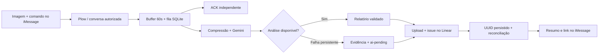

# Omni-Action Hub

**Menos relato. Mais resolvido.** Uma captura de tela e "Registra esse bug" no
iMessage viram uma issue no Linear — com evidência anexada e confirmação na conversa.

<div align="center">

[](https://youtube.com/shorts/HQ94KQGZa-c)

</div>

---

## Como funciona

```
Você (iMessage)              Omni-Action Hub                    Linear
      │                            │                              │
      ├── 📸 Screenshot ──────────►│                              │
      ├── "Registra esse bug" ────►│                              │
      │                            ├── ⏳ ACK instantâneo ───────►│ (iMessage)
      │                            ├── Comprime imagem            │
      │                            ├── Envia ao Gemini (visão)    │
      │                            ├── Extrai: tipo, severidade,  │
      │                            │   comportamento esperado...  │
      │                            ├── Upload do screenshot ─────►│
      │                            ├── Cria issue completa ──────►│
      │◄── ✅ Link do ticket ──────┤                              │
```

**Fluxo real:** você envia um print + comando no iMessage → o Omni confirma o recebimento (ACK) → o Gemini analisa a imagem e extrai contexto → o ticket é criado no Linear com screenshot anexado → você recebe o link na conversa.

> O tempo total depende do Gemini e da rede. O ACK chega em ~1s; a criação do ticket leva entre 5s e 50s dependendo da carga da API.

---

## 🚀 Instalação Rápida

### Passo 1 — Clone o repositório

```sh
git clone https://github.com/fecabral/omni-action-hub.git && cd omni-action-hub
```

### Passo 2 — Configure as variáveis

```sh
cp .env.example .env
chmod 600 .env
# Abra .env no seu editor e preencha as chaves (instruções dentro do arquivo)
```

### Passo 3 — Suba o container

```sh
docker compose -f docker-compose.prod.yml up -d
```

> **Pré-requisito único:** antes do Passo 3, você precisa provisionar suas credenciais Plow.
> Veja a seção [Configuração do Plow](#configuração-do-plow) abaixo.

---

## Pré-requisitos

| Recurso | Onde obter |
| --- | --- |
| Docker Desktop + Compose ≥ 2.30 | [docker.com](https://www.docker.com/products/docker-desktop/) |
| Chave API Gemini | [Google AI Studio](https://aistudio.google.com/app/apikey) |
| Chave API Linear (pessoal) | [Linear Settings](https://linear.app/settings/api) |
| UUID do time Linear | Menu de comandos → "Copy model UUID" |
| Linha Plow + telefone | [Plow Quickstart](https://github.com/plow-pbc/plow-agents#quickstart) |

A imagem roda em `linux/amd64`. No Apple Silicon funciona via emulação do Docker.

---

## Configuração do Plow

```sh
git clone https://github.com/plow-pbc/plow-agents.git work/plow-agents
git -C work/plow-agents checkout 8ce907e220ab67018d6857e8054a41eed4ecd279
work/plow-agents/bin/plow-agents login
work/plow-agents/bin/plow-agents lines
# Substitua ln_... pela linha livre mostrada:
work/plow-agents/bin/plow-agents mint ln_SUA_LINHA
chmod 600 plow-credentials
python3 scripts/setup.py --chat-id
```

Copie o `cht_...` impresso para `OMNI_ALLOWED_CHAT_ID` no `.env`.

---

## Uso

1. Capture a tela (`Cmd+Shift+4` no Mac).
2. Envie a imagem + "Registra esse bug" na mesma mensagem ao agente no iMessage.
3. Aguarde o ACK e, depois, o link do ticket no Linear.

**Comandos aceitos:** `Registra esse bug`, `Registra essa tarefa`, `Registra essa melhoria`, `Cria um card`, `/bug`, `/task`, `/feature`.

Aceita PNG, JPEG ou WebP (até 10 MB). Você pode enviar a imagem e o comando separados — a janela de associação é de 60 segundos.

---

## Diagnóstico

```sh
docker compose ps                                                    # Status
docker exec "$(docker compose ps -q agent)" /bin/sh -c 'omni doctor' # Saúde
docker exec "$(docker compose ps -q agent)" /bin/sh -c 'omni status' # Fila
```

Use `omni doctor --deep` para testar acesso real ao Gemini (consome quota).

---

## Desenvolvimento

```sh
python3 -m venv .venv
.venv/bin/pip install -e '.[test]'
.venv/bin/python scripts/fetch-reporter.py
.venv/bin/python scripts/fetch-transport.py
.venv/bin/pytest -q
```

Para dev local com build: `docker compose -f compose.yml up --build -d`.

---

## Parar e desinstalar

```sh
docker compose down          # Para (preserva dados)
docker compose down -v       # Para e remove dados locais
```

`down -v` não remove tickets do Linear nem revoga suas chaves — faça isso nas respectivas plataformas.

---

## Arquitetura



---

## Fontes

- [Base Plow](https://github.com/plow-pbc/plow-hermes-agent) · [Plugin Plow Chat](https://github.com/plow-pbc/hermes-plugin-plow) · [CLI Plow](https://github.com/plow-pbc/plow-agents)
- [API Gemini](https://ai.google.dev/api/generate-content) · [API Linear](https://linear.app/developers/graphql)
- [Agent Index](https://aiworthusing.com/agent-index)

---

## Licença

[MIT](LICENSE)
