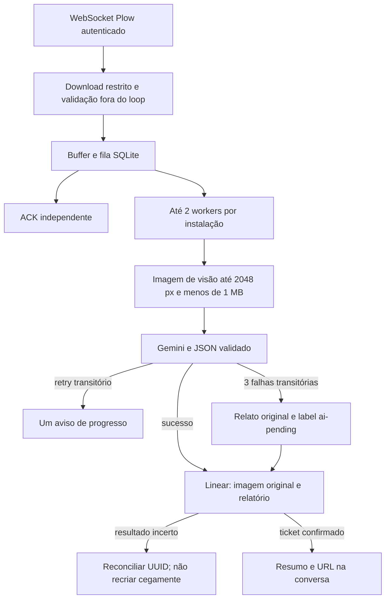

# Evolução do produto — implementação e operação

## Ordem de implementação

1. **Feedback conversacional:** ACK independente, aviso único de retry e resumo final.
2. **Auto-triage e fallback:** schema compatível, catálogo de labels e ticket `ai-pending`.
3. **Performance:** workers limitados, CPU de imagem fora do loop e conexões persistentes.
4. **Adoção:** diagnóstico profundo opcional e Compose sem build local.

## Fluxo executado

A entrada continua WebSocket: não há webhook HTTP ao qual devolver `200 OK`.
O `_on_message` oficial enfileira a resolução e libera a escuta; o `_deliver`
persiste o job e avança o cursor. Inferência e criação usam workers independentes.
A normalização Pillow na entrada e a compressão de visão executam via
`asyncio.to_thread`; o SQLite permanece no loop proprietário, sem compartilhar
a conexão com threads.

O worker e o emissor de ACK consultam a fila a cada 100 ms. O padrão é dois jobs
concorrentes, configurável de um a quatro com `OMNI_WORKERS`. Locks por grupos de
UUIDs impedem duas execuções simultâneas do mesmo job. O lock de processo continua
proibindo duas instâncias sobre o mesmo volume. Esta é uma arquitetura por
instalação, não um serviço SaaS com múltiplos tenants ou replicação horizontal.

## Entrega e recuperação

`notices` persiste uma reivindicação antes de enviar ACK ou aviso de retry.
Esses avisos são tentados no máximo uma vez: timeout ou queda após envio pode
perder um aviso, mas não inicia um loop de notificações. A mensagem final mantém
as três tentativas existentes e pode ser recuperada por `omni retry-reply` sem
recriar o ticket. Uma queda após envio da mensagem final e antes do commit ainda
pode duplicar a resposta; não pode duplicar a criação por esse caminho.

O aviso tem timeout de quatro segundos. Falha no ACK não bloqueia definitivamente
o trabalho. A inferência começa após a tentativa de ACK daquele job, enquanto
o emissor independente atende novos pedidos que chegarem durante inferências.

## Imagens e conexões

O `AsyncClient` é compartilhado durante a vida do gateway, com máximo de 20
conexões, 10 keep-alive e expiração ociosa de 60 segundos. Isso permite reuso de
conexões; não garante que o servidor mantenha toda conexão aberta.

Para Gemini, Pillow limita o maior lado a 2048 px. Primeiro tenta PNG sem perdas;
se não couber em 999.999 bytes, tenta JPEG com qualidade 90/82/75 sem subsampling
de cor, reduzindo dimensões até 1024 px se necessário. A legibilidade depende
da imagem: capturas com texto minúsculo podem exigir recorte. Não afirmamos
preservação perfeita de texto em qualquer captura, nem redução de tokens na mesma
proporção da redução de bytes. O Linear recebe a evidência normalizada original,
sem metadados EXIF, sem esse resize adicional.

## Schema e autoridade

O schema acrescenta `operating_system`, `component` e `analysis_status`, todos com
default para ler relatórios antigos. OS e componente aceitam `unknown`; a imagem
não prova uma causa Backend. A gravidade existente continua baixa/media/alta ou
indeterminada. Labels fornecidas ao modelo vêm do catálogo real de labels globais
e do time; nomes desconhecidos são descartados depois da inferência.

O código força `analysis_status=complete` para relatórios retornados pelo Gemini.
Somente uma exceção transitória esgotada (`unavailable`) ativa o fallback.
Credencial inválida, schema inválido, ausência de telemetria e imagem ilegível não
são convertidos em relatórios supostamente analisados.

O fallback usa o título cru após o comando, ou `Relato com screenshot` quando ele
não foi informado. Severidade fica indeterminada. O cliente Linear aplica apenas
o ID real da label `ai-pending`; se não conseguir resolvê-lo, falha explicitamente
em vez de criar um ticket sem a marcação prometida.

Na inicialização, o Omni prepara essa única label fixa se ela ainda não existir.
A tentativa de criação é registrada em `provisioning` antes da mutação e seguida
de readback. Se o resultado continuar incerto, não repete a mutação; o operador
verifica/cria a label no Linear. Não há criação de labels escolhidas pelo LLM.

## Diagnóstico

`omni doctor` carrega o ambiente s6 protegido, consulta Gemini/Linear/Plow,
verifica o cache e a travessia de seus diretórios ancestrais para o usuário de runtime, além da disponibilidade de `ai-pending`.
É um diagnóstico pontual de acesso, não uma garantia de disponibilidade futura.

`omni doctor --deep` faz uma chamada real de visão com schema e contabiliza seus
tokens. Não cria issue. Quando invocado por root no container, passa para o UID
10000 após carregar o ambiente s6. Isso evita confundir permissões de root com
as permissões reais do gateway.

## Arquivos principais

- `src/omni/gateway.py`: entrada, thread de imagens, pools e supervisão.
- `src/omni/workflow.py`: buffer, ACK, workers, fallback e recuperação.
- `src/omni/clients.py`: Gemini estruturado, catálogo Linear e criação restrita.
- `src/omni/feedback.py`: mensagens finais consistentes, usadas também pelo CLI.
- `src/omni/vision.py`: imagem compacta apenas para inferência.
- `docker-compose.prod.yml`: distribuição sem build local.

## Produção e rollback

A imagem base permanece linux/amd64. No Mac Apple Silicon há emulação; em uma VPS
amd64 não há essa diferença de arquitetura. A execução remota depende de acesso
válido ao serviço Plow, contas das APIs e credencial de agente já emitida. Não
elimina a preparação das contas nem substitui o gateway iMessage do provedor.

Use uma imagem publicada por digest, `.env` 0600 e volume persistente exclusivo.
O Compose não expõe portas nem monta o socket Docker. A migração SQLite é aditiva;
pare o container e faça backup do volume antes de voltar a uma versão anterior.
Não remova `state.db`, pois ele contém a deduplicação e os UUIDs de reconciliação.

Publicação depende de um registro e namespace escolhidos pelo proprietário.
A CI existente publica tags no GHCR quando executada em um repositório configurado;
um arquivo Compose sozinho não publica a imagem nem demonstra execução em AWS/GCP.
